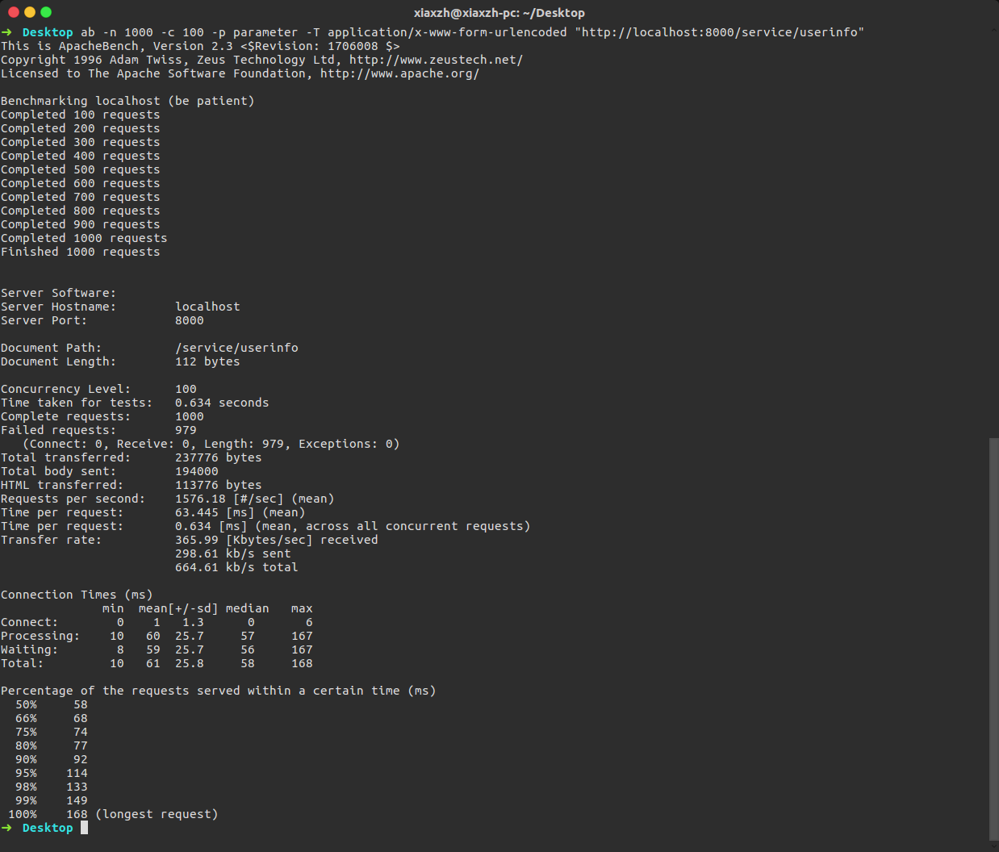
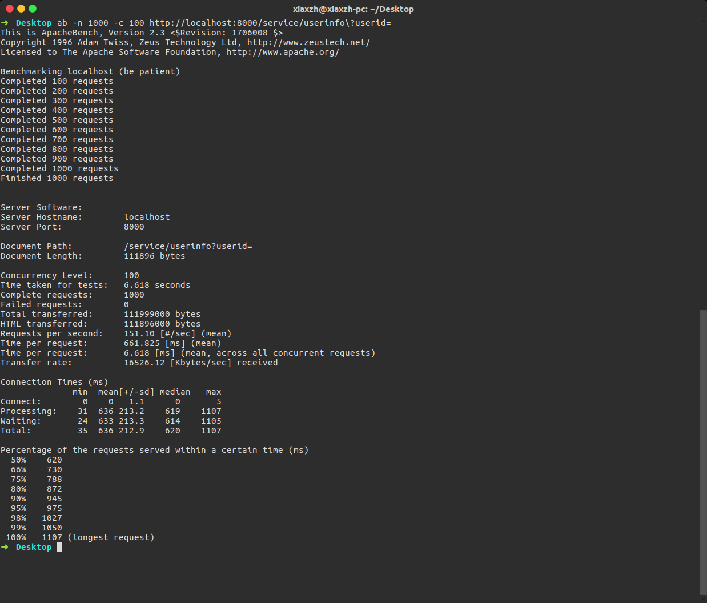
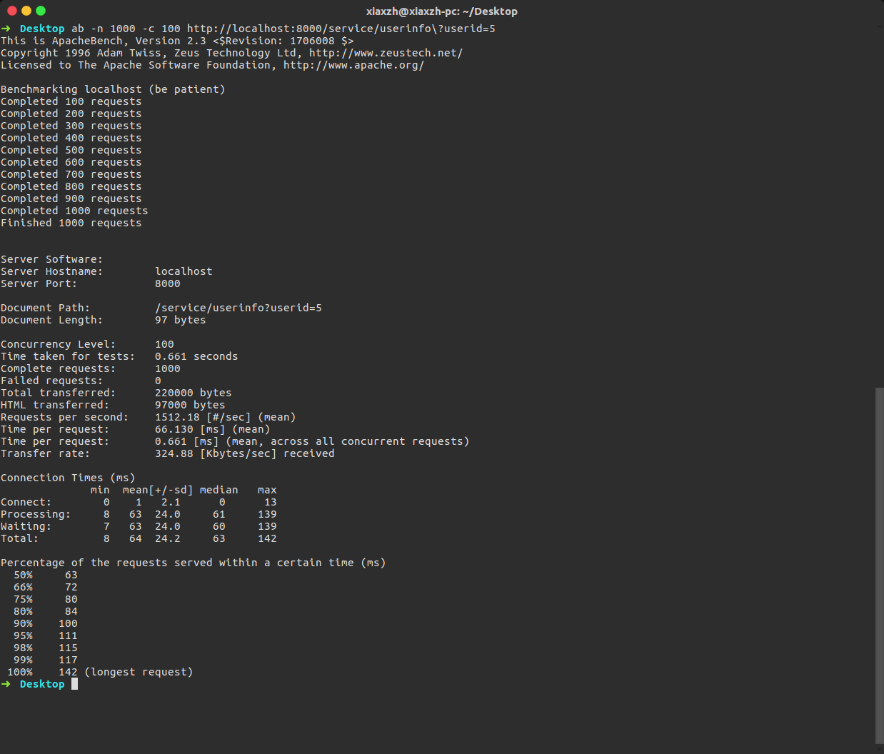
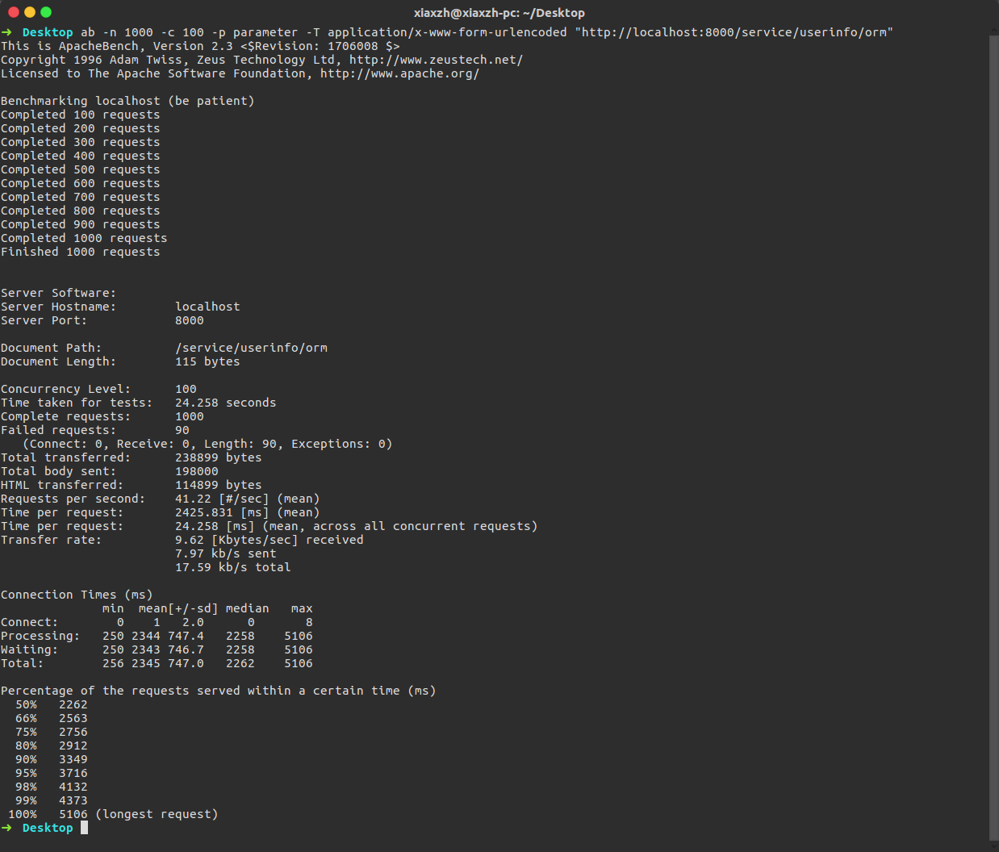
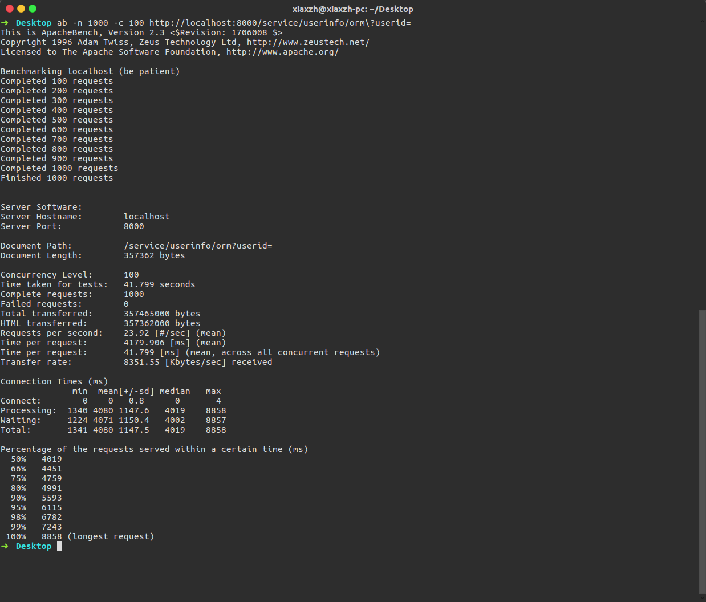

## cloudgo-data - Go Version

### database/sql

* ab 测试 POST请求添加到数据库
    ```
    ab -n 1000 -c 100 -p parameter -T application/x-www-form-urlencoded "http://localhost:8000/service/userinfo"
    ```
    

* ab 测试 GET请求查看所有用户
    ```
    ab -n 1000 -c 100 http://localhost:8000/service/userinfo\?userid=
    ```
    

* ab 测试 GET请求查看某个用户
    ```
    ab -n 1000 -c 100 http://localhost:8000/service/userinfo\?userid=5
    ```
    

### xorm

* ab 测试 POST请求添加到数据库
    ```
    ab -n 1000 -c 100 -p parameter -T application/x-www-form-urlencoded "http://localhost:8000/service/userinfo/orm"
    ```
    

* ab 测试 GET请求查看所有用户
    ```
    ab -n 1000 -c 100 http://localhost:8000/service/userinfo/orm\?userid=
    ```
    

* ab 测试 GET请求查看某个用户
    ```
    ab -n 1000 -c 100 http://localhost:8000/service/userinfo/orm\?userid=5
    ```
    