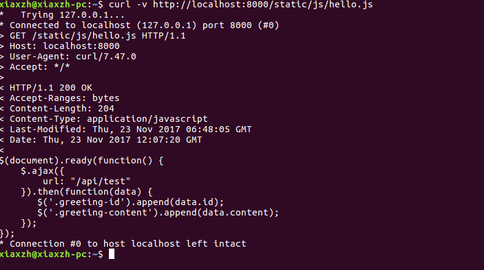
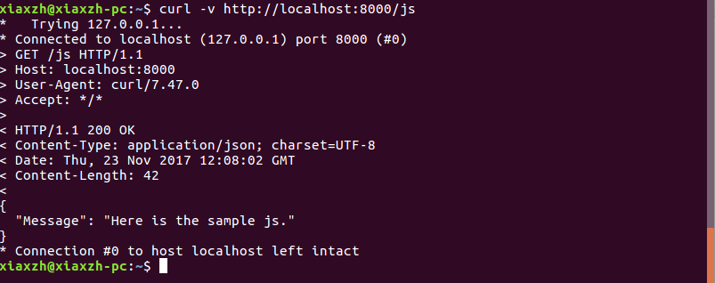
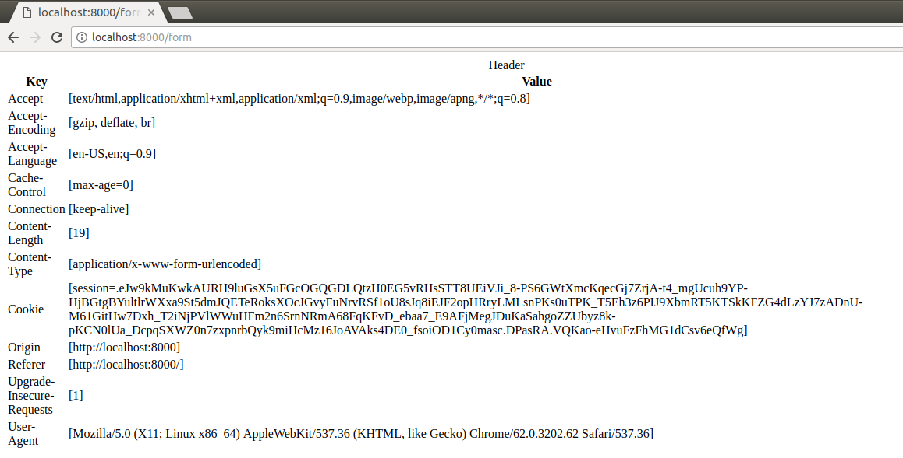

## cloudgo-inout - GO Version

### 支持静态文件服务
```
curl -v http://localhost:8000/static/js/hello.js
```


### 简单的js访问
```
curl -v http://localhost:8000/js
```


### unknown 返回5XX
```
curl -v http://localhost:8000/unknown
```


### 提交表单，输出表格
```
curl -v -d "" http://localhost:8000/form
```

