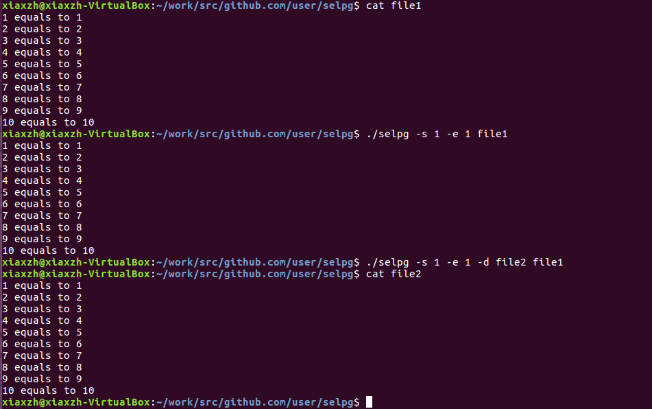
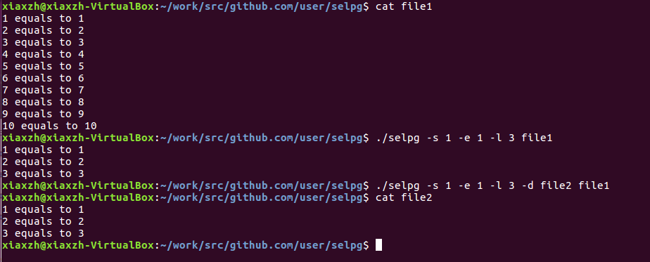

# server-computing-homework
## selpg, in go [要求详情](https://www.ibm.com/developerworks/cn/linux/shell/clutil/index.html)
### 说明
1. selpg : 一个类似于cat命令的指令
           
        -s           --- (int) start page default -1
            
        -e           --- (int) end page default -1
            
        -l           --- (int) line length, default 72
            
        -f           --- (bool) use '\f' to split pages default false
            
        -d           --- (string) consider it as the destination file default "", consider stdout as default
            
            ([filename]) --- (string) scan file, when you do not enter it , consider stdin as default
            
2. 文件名应放在所有带'-'的参数后面

        selpg -s 1 -e 1 -d destination inputfile     is     OK
            
        selpg -s=1 -e=1 -d=destination inputfile     is     OK
            
        selpg -s 1 -e 1 inputfile -d destination     is     Wrong  because -d destination is considered as ([filename])
            
        selpg -s=1 -e=1 inputfile -d destination     is     Wrong  because -d destination is considered as ([filename])

3. 结果
        
        
        
        
        
