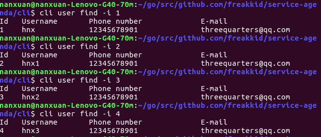
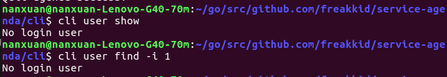
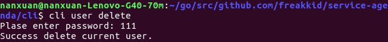

# service-agenda

[](https://travis-ci.org/freakkid/service-agenda)


## About the program

The program could register, login, show users information, delete user, update password.

## Docker

### Maintainer

TangXuanzhao xuanzhaotang@gmail.com

### Tips on using
**Note, please use txzdream/agenda instead of agenda-go when pulling image.**

1. 
    Create a server container with `docker run -d --name agendad agenda-golang`

2. 
    Conntet to server with `docker run -it agenda-golang [command]`.
    
    If the command is empty, it will start server in default. You can only use client container once because the process will quit after the command.

    But you can choose to run with `docker run --entrypoint="" -it agenda-golang sh` to run with shell, in shell, you can use `agenda -h` to know more message about usage.

3. 
    If you want to connent to other url in the client, please makesure to use `-e "SERVER_URL=value"` in docker, client will connect to the url you set on `SERVER_URL` environment.

4. 
    Please configure two container(client and server) in one docker network, otherwise, they can not connect with eachother.

5. 
    You can specify the server port with `PORT` enviroment, the default value is 80


### Sample

- Create a network named agenda

    `docker network create agenda-golang`

- Create server container and connect it to the agenda network
    
    `docker run -d --name agendad --network agenda agenda-golang`
    
- Create client container to connect to the server
    
    `docker run -it --entrypoint="" --name agenda --network agenda agenda-golang sh`.
    
    In shell, you can use `agenda -h` to konw how to use our program

## Usage

* Get [code](https://github.com/freakkid/service-agenda)

    > go get github.com/freakkid/service-agenda

* Install

    + Install client

        > go install github.com/freakkid/service-agenda/cli
    
    + Install server

        > go install github.com/freakkid/service-agenda/service

* Run
    
    + Run server

        The default port is 8080:

        > service

        ```
        [negroni] listening on :8080
        ...
        ```

        Or the port can be set by:

        > server -p 9090

        ```
        [negroni] listening on :9090
        ...
        ```

        End the program by Ctrl + C


    + Run client and Show simple test result

        - register user

            > cli user create -u hnx -p 12345678901 -e threequarters@qq.com

            create user successfully:

            

            create a user of the same name and failed to create

            

            create other users

            

        - login
        
            > cli user login -u hnx

            login with incorect password and failed:

            

            login successfully:

            
        
        - show
        
        > cli user show

        defaultly show 5 users and offset is 0:

        

        show at most 10 users and offset is 0:

        

        show at most 10 users and offset is 2:

        >  cli user show -l 10 -o 2


        - find
        
            >  cli user find -i 1

            show user infomation by ID:

            

            example of failing to show user infomation:

            

            
           
        - update password
            
            > cli user update

            

            incorrect password:

            

        - logout
        
            > cli user logout
            
            

            after loging out, client could only do regiesting or login

            

        - login by new password
            
            

        - delete user

            > cli user delete

            incorrect password to delete user:

            

            delete the user whose ID is 1 successfully:

            

            let other user login to checked if the user whose ID is 1 have been deleted successfully:

            

            the deleted user tried to login but failed:

            

        To sum up, the program has passed all Basic test.

    * About generated files
        
        - server file:

            + agenda.db stored users data will be placed in the same directory with main.go of server

        - client files:

            + currentUser: stores data of login user

            + session: stores sessionID of user